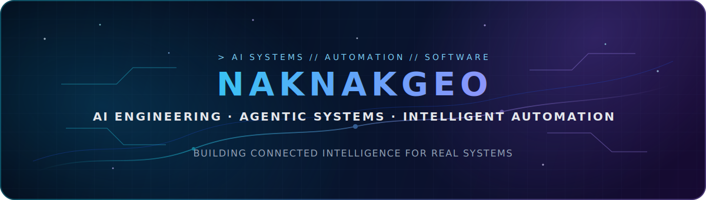

<div align="center">
  
</div>

<br>

<div align="center">

[](https://github.com/NakNakGEO)
[](https://github.com/NakNakGEO?tab=followers)

</div>

## `> IDENTITY`

**NakNakGEO** is my developer identity for building serious software, AI systems, and intelligent automation.

```text
SYSTEM STATUS   : ONLINE
PRIMARY MODE    : SOFTWARE + AI ENGINEERING
CURRENT VECTOR  : AGENTS · LOCAL AI · AUTOMATION · SYSTEM ARCHITECTURE
```

I focus on:

- AI-driven tools and specialized agent workflows
- backend services, workflow platforms, and data-intensive systems
- local model infrastructure, repository intelligence, and connected knowledge
- research-oriented engineering for intelligent and reliable products

## `> CORE STACK`

<div align="center">


</div>

## `> ACTIVE SYSTEMS`

<table>
  <tr>
    <td width="50%" valign="top">
      <h3 align="center">Agentic AI Platform</h3>
      <p>
        A private AI engineering environment for coordinating specialized agents, development workflows, research tasks, project memory, and local or cloud model execution.
      </p>
      <p><strong>Core:</strong> orchestration, tool use, knowledge retrieval, evaluation, observability, and secure automation.</p>
    </td>
    <td width="50%" valign="top">
      <h3 align="center">AI Trading Research System</h3>
      <p>
        A private multi-layer research platform combining market data, technical structure, machine learning, LLM reasoning, signal validation, and risk controls.
      </p>
      <p><strong>Core:</strong> data quality, regime detection, ensemble decisions, explainability, backtesting, and execution safety.</p>
    </td>
  </tr>
  <tr>
    <td width="50%" valign="top">
      <h3 align="center">Local AI Infrastructure</h3>
      <p>
        A distributed environment for running local models, coding agents, vector search, repository intelligence, and persistent project knowledge across multiple machines.
      </p>
      <p><strong>Core:</strong> model serving, inference routing, GPU utilization, indexing, privacy, and reliability.</p>
    </td>
    <td width="50%" valign="top">
      <h3 align="center">Enterprise Automation</h3>
      <p>
        Backend services and workflow solutions for approvals, identity integration, reporting, business rules, and operational process automation.
      </p>
      <p><strong>Core:</strong> C#, SQL Server, APIs, workflow engines, access control, and production support.</p>
    </td>
  </tr>
</table>

> Most active projects are private because they contain internal architecture, proprietary workflows, research logic, or production-related integrations.

## `> SYSTEM PIPELINE`

```text
DATA INPUTS
    ↓
RELIABLE BACKEND SERVICES
    ↓
MACHINE LEARNING + LLM REASONING
    ↓
SPECIALIZED AGENTS + ORCHESTRATION
    ↓
OBSERVABLE, SECURE AUTOMATION
```

My long-term direction is to build an integrated AI engineering platform that can understand repositories, preserve project knowledge, support software development, coordinate specialized workers, and improve technical decisions.

## `> ENGINEERING PROTOCOL`

- Reliability before unnecessary complexity
- Evidence before automated decisions
- Deterministic control around AI reasoning
- Private-by-default infrastructure for sensitive systems
- Traceable actions, measurable performance, and safe failure modes

## `> ACTIVITY SIGNAL`

<div align="center">
  
</div>

---

<div align="center">
  <sub>SCIFI AESTHETICS · REAL ENGINEERING · AI-FIRST THINKING</sub>
</div>
