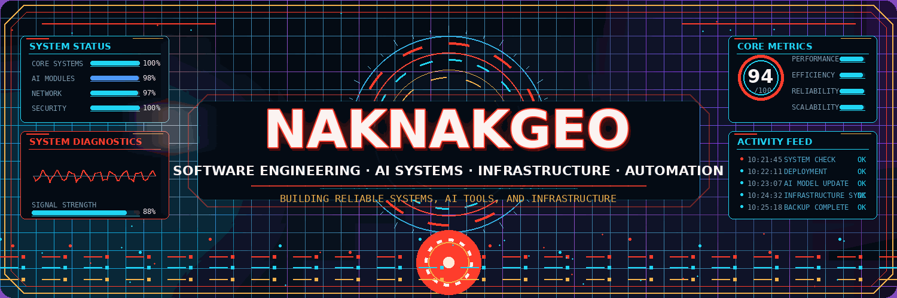

  

 

## About

I build software across backend development, AI systems, application engineering, infrastructure, and automation for real-world workflows.

My main areas of interest are:

- multi-language software and application development
- AI agents, LLM tooling, and intelligent workflows
- backend services, APIs, and system architecture
- local AI infrastructure, model serving, and orchestration
- machine learning, research systems, and automation
- server, network, deployment, and observability infrastructure
- enterprise workflow systems, access control, and operational reliability

## Technical stack

### Languages

### Frameworks & application development

### Data, integration & reporting

### AI, infrastructure & operations

### Engineering foundations

**Object-oriented programming (OOP)** · system architecture · API design · asynchronous processing · data structures · distributed systems · CI/CD · observability · secure automation

## Current focus

<table>
  <tr>
    <td width="50%" valign="top">
      <h3 align="center">Agentic AI Platform</h3>
      

        A private engineering environment for coordinating specialized agents, development workflows, research tasks, project memory, and local or cloud model execution.
      

      
<strong>Focus:</strong> orchestration, tool use, retrieval, evaluation, observability, and secure automation.

    </td>
    <td width="50%" valign="top">
      <h3 align="center">AI Trading Research</h3>
      

        A private research platform combining market data, technical structure, machine learning, LLM reasoning, signal validation, and risk controls.
      

      
<strong>Focus:</strong> data quality, regime detection, ensemble decisions, explainability, backtesting, and execution safety.

    </td>
  </tr>
  <tr>
    <td width="50%" valign="top">
      <h3 align="center">Local AI Infrastructure</h3>
      

        A distributed environment for running local models, coding agents, vector search, repository intelligence, and persistent project knowledge across multiple machines.
      

      
<strong>Focus:</strong> inference routing, model serving, GPU utilization, indexing, privacy, and reliability.

    </td>
    <td width="50%" valign="top">
      <h3 align="center">Infrastructure & Operations</h3>
      

        Practical work across servers, networking, deployment environments, system reliability, and enterprise workflow operations.
      

      
<strong>Focus:</strong> Linux systems, Docker, networking, deployment, monitoring, access control, and maintainable production systems.

    </td>
  </tr>
</table>

> Most active projects are private because they contain internal architecture, research logic, or production integrations.

## Engineering approach

- Reliability before complexity
- Evidence before automated decisions
- Clear boundaries between AI reasoning and deterministic control
- Privacy for sensitive systems
- Measurable performance and traceable actions

## GitHub activity

  

---

  Building reliable software, AI systems, and infrastructure.

